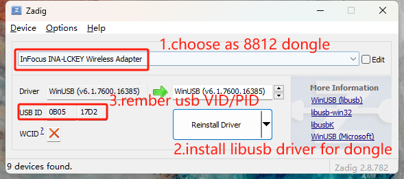

# rtl8812au-monitor-pcap
Use RTL8812AU to capture 802.11 raw data frame and dump to .pcap file on Windows

### rtl8812au userspace driver
[devourer](https://github.com/openipc/devourer)

The RTL8812AU driver that simply devours its competitors

### usage
- Repair libusb driver

- Command line
```
WiFiCapture [USB_VID]:[USB_PID] [WIFI_CHANNEL] [PCAP_FILE_NAME]

example:
capture dongle (0B05:17D2) WIFI channel 80 to 80211.pcap

WiFiCapture 0B05:17D2 2 80211.pcap


```
- WIFI channel enum
```c++
enum ChannelWidth_t {
  CHANNEL_WIDTH_20 = 0,
  CHANNEL_WIDTH_40 = 1,
  CHANNEL_WIDTH_80 = 2,
  CHANNEL_WIDTH_160 = 3,
  CHANNEL_WIDTH_80_80 = 4,
  CHANNEL_WIDTH_5 = 5,
  CHANNEL_WIDTH_10 = 6,
  CHANNEL_WIDTH_MAX = 7,
};
```

### Windows

You can download and install libraries using the vcpkg dependency manager:

```
cd rtl8812au-monitor-pcap
git clone https://github.com/Microsoft/vcpkg.git
cd vcpkg
.\bootstrap-vcpkg.bat
.\vcpkg integrate install
.\vcpkg install libusb libpcap
cd ..
cmake -DCMAKE_TOOLCHAIN_FILE=vcpkg/scripts/buildsystems/vcpkg.cmake  -G "Visual Studio 16 2019" -A x64 -S ./ -B "build64" 
cmake --build build64 --config Release --target WiFiCapture
```
